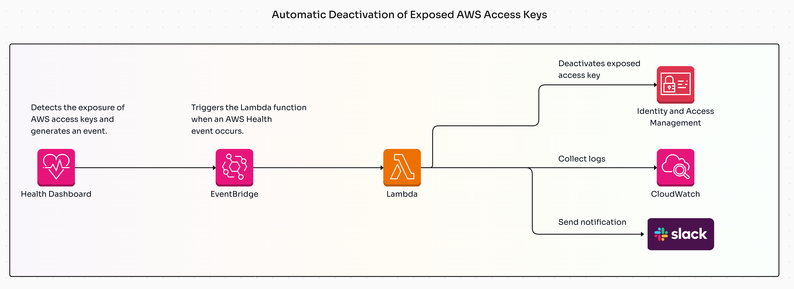

# Exposed AWS Access Keys Remediation

## Overview
This project provides a Lambda-based solution for detecting and remediating exposed AWS access keys on public source code management platforms like GitHub. When an exposed key is detected, the system suspends the associated IAM access key, gathers usage logs, and sends a notification via SNS.

## Features
- **Key Suspension**: Automatically suspends any exposed AWS access key to mitigate potential security risks.
- **Log Analysis**: Gathers CloudTrail logs for the past 24 hours related to the exposed key and checks for suspicious activity.
- **Notifications**: Sends an SNS notification with details of the exposed key and actions taken.
- **Cloud Infrastructure**: Infrastructure setup using CloudFormation or Terraform.

## Architecture

The system includes the following AWS services:
- **Lambda**: A serverless function that processes the event, suspends the access key, gathers logs, and sends a notification.
- **SNS**: Used to send notifications when a key is suspended.
- **CloudTrail**: Provides logs of all AWS service events, which are analyzed to detect suspicious activity.

## Requirements
- AWS account with IAM and SNS permissions
- CloudFormation or Terraform setup to deploy required infrastructure
- Python 3.8+ (if using Lambda runtime)

## Setup Instructions

### Prerequisites
1. **IAM Permissions**: Ensure that your IAM role has permissions to access IAM keys, CloudTrail logs, and SNS publishing.
2. **CloudFormation/Terraform Setup**: Deploy the required infrastructure using the provided CloudFormation or Terraform scripts.

### Deploying the Lambda Function
1. Clone this repository:
   ```bash
   git clone https://github.com/yourusername/exposed-aws-keys-remediation.git
   cd exposed-aws-keys-remediation
2. Install dependencies for Lambda Function:
   ```bash
   pip install -r src/requirements.txt
3. Deploy the infrastructure (CloudFormation or Terraform):
    ```bash
    # For CloudFormation:
        aws cloudformation deploy --template-file infrastructure/cloudformation.yaml --stack-name ExposedKeysStack
    # For Terraform:
    terraform init
    terraform apply
4. Upload the Lambda code to AWS or deploy it via the AWS CLI.

### Testing
1. Test the Lambda function: Use sample event data to trigger the Lambda function and check if it correctly suspends the key and sends an SNS notification.
    ```json
    {
        "source": "aws.health",
        "detail-type": "AWS Health Event",
        "detail": {
        "service": "RISK",
        "eventTypeCategory": "issue",
        "eventTypeCode": "AWS_RISK_CREDENTIALS_EXPOSED",
        "affectedEntities": [
                {
                "entityValue": "ACCESS_KEY_ID",
                "entityType": "ACCESS_KEY"
                }
            ]
        }
    }
2. Check the SNS notification: Ensure that the SNS notification contains the correct details about the exposed key and its remediation.

